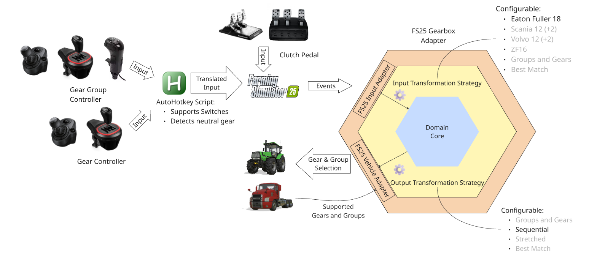
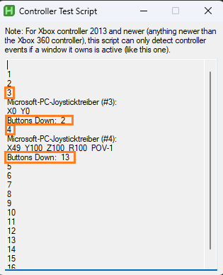
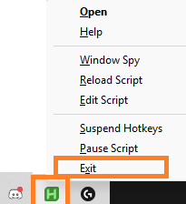

# FS25 Gearbox Adapter

## What does the mod do?

- The mod allows the usage of USB Truck shifter controllers in Farming Simulator 25. It requires an AutoHotkey script to do so, however.
- It allows using various realistic shifting patterns, and various gear selection strategies to be used (work in progress).
- It also detects switching to neutral gear with a regular H shifter (only for manual transmission)

## Architecture Overview



## How to use the mod

### One-time setup for truck shifting knob + H shifter

The initial setup procedure is not straightforward, but it's unfortunately necessary. I'll walk you through it, you only need to do it once:

1. Download and install [Autohotkey v2.0 (Ctrl+Click to open in a new tab)](https://www.autohotkey.com/) (or [build it from source if you prefer](https://github.com/AutoHotkey/AutoHotkey/tree/alpha)).  This is a program which is able to execute scripts which can amongst others capture and simulate key presses, mouse movements etc.
1. Download both of the zip files from [the most recent release](https://github.com/Timmeey86/FS25_GearboxAdapter/releases)
1. Extract the `GearboxAdapter_Autohotkey.zip` to anywhere where you'll find it again. (**Don't just double click. Extract it!**)
1. Doubleclick the `ControllerTestScript.ahk` in order to run the script. You'll see a window like this: 
1. Flip the switches on your truck shifting knob in order to find out which number this controller has in your system, and remember that number (in my example, it's `3`). For "Buttons Down: ", it should always show "1" and "2".
1. Use your H shifter and remember the number of that controller, plus the numbers of your six gears plus the reverse gear as well (in my case, it's controller `4`, buttons `13`-`18` for forward gears, and `19` for reverse).
1. Stop the script **through the tray icon in the bottom-right of your screen (click the upwards arrow to unfold)**. Closing the window will still run the script in background. 
1. If your controller numbers and buttons are not identical to my numbers, right-click the `ShifterMapping.ahk` script and edit the file in a text editor [like Notepad++](https://notepad-plus-plus.org/). Otherwise skip the next two steps.
1. In lines 4-5, where it says `3Joy2` and `3Joy1`, replace the `3` by the number of your truck shifting knob. In lines 6-12, replace the `4` by the number of your H shifter controller and replace the `13-19` by your button numbers, if necessary.
1. Save the script and close the text editor
1. Copy the `FS25_GearboxAdapter.zip` to your `mods` folder (by default `Documents\my games\FarmingSimulator2025\mods`). Don't extract the zip, just copy the file.
1. Start the game, open the settings and **unbind any controller inputs currently bound to gears or gear groups**.
1. Make sure you bind something to "Change direction", e.g. the push button on your truck shifting knob (top left in my case). Save the settings.
1. Open your savegame, make sure to select the new Gearbox Adapter mod, load into the game, save and exit (just so you don't forget it later).

### After every restart of your computer

1. Double click the `ShifterMapping.ahk` script in order to run it.
1. Start the game and load into your savegame (You can safely do this before running the script, too).

### How it works ingame

- Currently, CVT transmissions are not handled by the mod, so you can simple use your "Change direction" binding and not worry about the shifter
- In manual and powershift transmissions, you can currently use [the Eaton 18 shifter pattern, except for the LH/LL gears](https://www.reddit.com/media?url=https%3A%2F%2Fi.redd.it%2Fhlsg1dpl4ce61.png). In the future, you'll be able to select your favourite pattern.
- If the vehicle has powershift for gear groups, or gears, you can do changes without pressing the clutch.
- For manual transmissions, you'll have to press the clutch. You can however pre-queue gear group changes, which will then get selected as soon as you press the clutch. If you remove a gear without pressing the clutch, or release the clutch while in neutral, your vehicle will be in neutral gear.
- If the vehicle has more than 16 gears, you can currently not reach anything beyong 16
- If the vehicle uses gear groups, your input will select the gears and gear groups sequentially, so for 3 groups with 5 gears each, 1L => 1.1, 1H => 1.2, ... , 3L => 1.5, 3H => 2.1 and so on

The script is written so that it only ever sends input to Farming Simulator 25. It therefore does not matter if you exit it after quitting the game, or if you leave it running - your call.

## FAQ

### Will the mod be on Mod Hub?

No, with it relying on an additional script which must be executed separately, that is unlikely.

### Is the AutoHotkey script really necessary?

If you are using a truck shifter knob like in the picture above, then yes, it is necessary. If you are using some kind of different setup like two H-shifters at the same time, you might be able to cope without the script

### Why can't I reverse some machines?

You are likely sitting in a machine which doesn't have backwards gears or gear groups, but instead allows the same gears in two directions. For these vehicles, you need to toggle the driving direction manually, as it is done in real life. If you are using a truck shifter knob that has a button on top of the two switches, it is recommended to bind that to the base game setting for changing directions (Space key by default).

## For developers

### Detailed Architecture

This mod tries to increase portability between game versions using a hexagonal architecture (ports and adapters) approach:

- The domain package contains the main logic of transforming various abstract inputs into a gear selection based on the desired strategy. It knows nothing about Farming Simulator. Instead, it exposes an incoming interface (port) to be implemented by FS-specific classes (adapters), and performs calls on outgoing interfaces (also adapters).
- The gear input adapter translates between specific Farming Simulator input actions and generic domain inputs.
- The gear change adapter implements the domain core's outgoing interfaces and translates the generic actions into specific Farming Simulator commands.
- The GearboxAdapter.lua is the composition root which assembles all the required objects.

Some of the benefits of doing this are:
- The domain core can be easily unit tested, without having to rely on knowledge about complex game tables.
- The domain core is reusable between different Farming Simulator versions - "only" the adapters have to be implemented.
- The domain core has a much lower complexity since it does not mix domain logic with Farming Simulator specifics.

### Unit Testing

This mod uses the [busted](https://lunarmodules.github.io/busted/) framework for unit-testing the domain core.

In order to do this, you'll need the following things:

- The [lua compiler](https://www.lua.org/download.html)
- The [lua package manager](https://luarocks.org/)
- `luarocks install busted` (For executing unit tests)
- `luarocks install luacov` (For generating code coverage)
- `luarocks install luacov-reporter-lcov` (For converting code coverage to a more common format)
- The [Coverage Gutters plugin for VSCode](https://github.com/ryanluker/vscode-coverage-gutters) (You can find it in the VSCode marketplace for free)

Once you've got that all set up, you can create a local batch file like

```bat
::run_test.bat:

:: Delete the coverage file since otherwise line hits will accumulate
del luacov.stats.out

:: Run the tests with coverage on anything inside the "test" folder and use the .luacov in that folder for configuration
busted --coverage --coverage-config-file=test\.luacov -o plainTerminal test\*
```

In the .vscode folder, select, add the following configuration in the settings.json:

```json
{
	"coverage-gutters.coverageFileNames": [
		"luacov.report.out"
	]
}
```

If you then press Ctrl+Shift+P in VSCode and execute "Coverage Gutters: Watch", you'll start seeing Code Coverage markers as soon as you execute the run_tests.bat